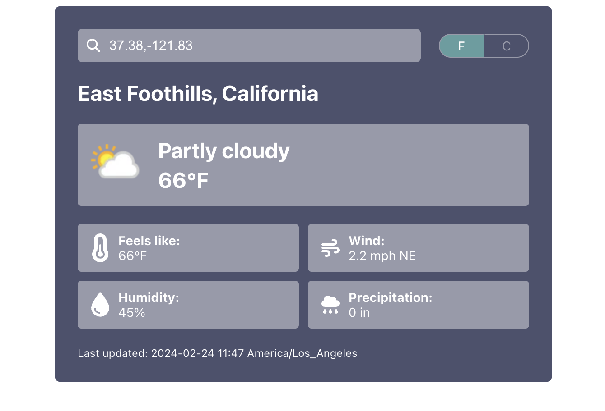
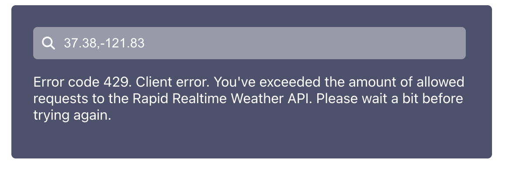

# Tread Weather Widget

## Overview

This application is designed to allow users to get the current weather for a queried location. It uses the [Rapid Realtime Weather API](https://rapidapi.com/weatherapi/api/weatherapi-com/) to source its data. Users can search on the following items:
- Latitude and Longitude (e.g. 48.8567,2.3508)
- City name (e.g. Chicago)
- US zip code (e.g. 78703)
- UK postcode (e.g. SW1)
- Canadian postcode (e.g. G2J)
- IP address (e.g. 100.0.0.1)

This project was built using React and TypeScript with [Create React App](https://github.com/facebook/create-react-app) as its starter template. Styling was done using [CSS Modules](https://github.com/css-modules/css-modules). Testing was done using [Jest](https://jestjs.io/) and [React Testing Library](https://testing-library.com/). No additional dependencies were added and no additional configuration was done to the base Create React App template.

All weather fetching logic and state was placed in the [useWeatherData](https://github.com/djsaun/tread-weather-widget/blob/main/src/hooks/useWeatherData.tsx) custom hook. This hook was imported in [App.tsx](https://github.com/djsaun/tread-weather-widget/blob/main/src/App.tsx) and the relevant data was passed as props to the App component's children components. Given the small scope of this project and the lack of deeply nested components, this state management setup seemed like a reasonable approach. However, I recognize that this approach would not scale well for larger applications that require passing props through multiple nested components. Had I implemented dark mode or the ability to change languages, which would have required passing the same information to each component, I would have strongly considered using [React Context](https://react.dev/learn/passing-data-deeply-with-context) as the state management solution for this application. I did not consider using Redux or MobX for this application as both solutions seemed like overkill for an app of this size and scale.

Please feel free to play around with the production version of this widget at [https://tread-weather-widget-8ejf4tx15-djsaun1.vercel.app/](https://tread-weather-widget-8ejf4tx15-djsaun1.vercel.app/).

## Getting Started

To run the application locally:

1. Clone the repository: `git clone https://github.com/djsaun/tread-weather-widget.git`
2. Navigate to `.env` and add your API key to `REACT_APP_RAPID_REALTIME_WEATHER_API_KEY=`
3. Install the dependencies: `npm install`
4. Run the app: `npm run start`

## Features
The weather widget provides the following weather information upon searching a location:
- Current conditions (e.g. sunny, cloudy, etc.)
- Temperature
- Feels like temperature
- Wind conditions (speed and heading)
- Humidity
- Precipitation

### Geolocation
The widget makes use of the browser's [Geolocation API](https://developer.mozilla.org/en-US/docs/Web/API/Geolocation_API) to provide the current weather conditions at your present location upon loading the application. Please note that this is an opt-in feature. If you do not provide permission to your browser to access your location, you'll see the default widget state when you first load the application:

### Unit Conversion
When weather data is present in the widget, an imperial/metric toggle will display that allows the users to quickly change between units.

### UX/UI 
The widget is fully responsive and includes weather-related iconography.

### Error Handling
The app [successfully handles 4xx and 5xx errors](https://github.com/djsaun/tread-weather-widget/blob/main/src/hooks/useWeatherData.tsx#L68-L88) and will display a human-readable error message should a request fail.

### Testing
I added testing to ensure that the weather widget shows loading, error, and success states when expected. I also added tests to ensure that the imperial to metric converstion works properly.

### Future Todos

#### Improved error handling
While the Rapid Weather API's responses did include status codes, they did not include status text, which made it difficult to dynamically display relevant error messages. If I had more time, I would have tailored custom error messages for frequently-encountered errors to provide a better user experience when requests fail.

I would also have liked to have added monitoring via Datadog to determine which errors are occurring most often and to track the frequency of errors over time.

#### Accessibility
I ensured that the widget had some accessibility features, but given more time, I would like to navigate the widget with a screen reader to ensure that I'm providing a consistent experience for all users.

I would also like to ensure that the color scheme has enough color contrast to provide a better experience for visually-impaired users.

#### Cross-Browser Testing
Due to time constraints, I was only able to test the widget in Chromium and Firefox browsers. I would like to view the widget in Microsoft Edge, etc. to ensure that the widget is providing a consistent experience across all environments.

#### Additional Unit and Integration Tests
I would like to add additional tests to ensure that the functionality around getting the user's location from the geolocation API and getting the user's weather conditions from the Rapid Weather API continue to work as expected.

#### Dynamic Background Colors
I would have liked to have had the widget's background color reflect the current weather conditions (e.g. a gradient from yellow to orange for sunny, a gradient from dark blue to purple for rainy, etc), but I did not have time to implement this functionality.

#### Google Maps Integration
I considered adding a Google Maps instance to the widget that would dynamically pan to the queried location upon a successful response from the Rapid Weather API. I would have also liked to look into querying the Rapid Weather API by selecting a point on the Google Map directly.

#### Random Location Button
I considered adding a "Random Location" button that would query a random city name or random latitude and longitude and return the current weather conditions from that location.